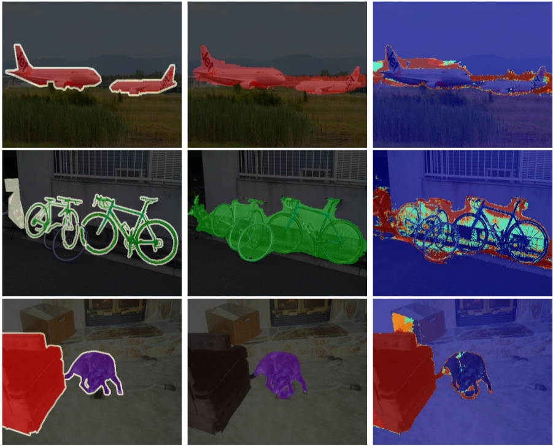
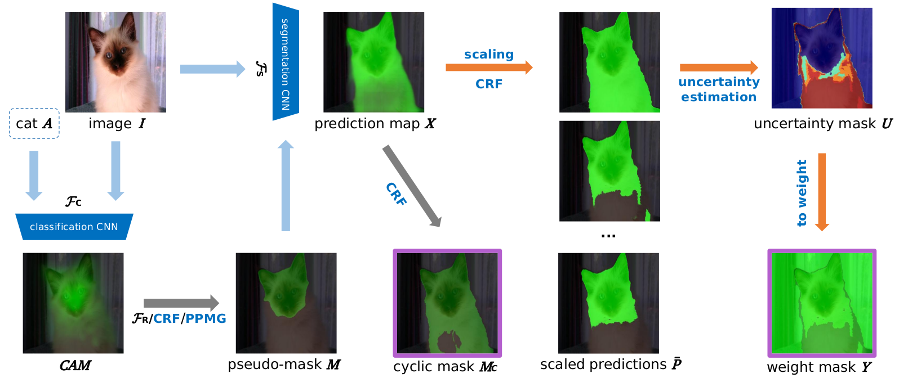

# Uncertainty Estimation via Response Scaling for Pseudo-mask Noise Mitigation in Weakly-supervised Semantic Segmentation

## Introduction

This is a PyTorch implementation of [Uncertainty Estimation via Response Scaling for Pseudo-mask Noise Mitigation in Weakly-supervised Semantic Segmentation](https://arxiv.org/abs/2112.07431) (AAAI2022), based on [mmsegmentation](https://github.com/open-mmlab/mmsegmentation). Please refer the classification phase to [PMM](https://github.com/Eli-YiLi/PMM) and refer the segmentation phase to [WSSS_MMSeg](https://github.com/Eli-YiLi/WSSS_MMSeg).

In this papper, we mitigate the noise of pseudo-mask in segmentation phase via uncertainty from response scaling which simulates the behavior of noise. *This technique is applicable to all weakly-supervised semantic segmentation methods based on fully-supervised semantic segmentation*.

Uncertainty visualization


Framework visualization


## Preparation
(Extract code of BaiduYun: mtci)
**Datasets and pretrained weights**
VOC12 [OneDrive](https://1drv.ms/f/s!Agn5nXKXMkK5aigB0g238YxuTxs), [BaiduYun](https://pan.baidu.com/s/1GL3zXZuapuXmH9E7Xy8-Fg);
COCO14 [BaiduYun](https://pan.baidu.com/s/1GL3zXZuapuXmH9E7Xy8-Fg);
Pretrained weights [OneDrive](https://1drv.ms/f/s!Agn5nXKXMkK5aigB0g238YxuTxs), [BaiduYun](https://pan.baidu.com/s/1GL3zXZuapuXmH9E7Xy8-Fg)
**Pseduo-masks from classification phase**
Pseudo-masks (if you want to skip cls phase), [VOC12 OneDrive](https://onedrive.live.com/?authkey=%21ACgB0g238YxuTxs&cid=B9423297729DF909&id=B9423297729DF909%21110&parId=B9423297729DF909%21109&o=OneUp), [COCO14 BaiduYun](https://pan.baidu.com/s/1GL3zXZuapuXmH9E7Xy8-Fg)
**Intermediate segmentation weights for uncertainty and cyclic pseudo-mask**
Intermediate weights (if you want to skip first segmentation), [BaiduYun](https://pan.baidu.com/s/1GL3zXZuapuXmH9E7Xy8-Fg)
**Released segmentation weights for test and visualization**
Released weights, [BaiduYun](https://pan.baidu.com/s/1GL3zXZuapuXmH9E7Xy8-Fg)

Once downloaded, execute the following commands to link the datasets and weights.

    git clone https://github.com/XMed-Lab/URN.git
    cd URN
    mkdir data
    cd  data
    ln -s [path to model files] models
    ln -s [path to voc12] voc12
    ln -s [path to coco2014] coco2014
    ln -s [path to your voc pseudo-mask] voc12/VOC2012/ppmg
    ln -s [path to your coco pseudo-mask] coco2014/voc_format/ppmg

## Run the code
(If you don't run on server cluster based on srun, please modify the scripts "tools/dist_\*.sh" refer to given scripts "tools/srun_\*.sh")

**Installation**
    cd URN
    pip install mmcv==1.1.5
    pip install -e .
(If you meet installation problems, please refer to [mmsegmentation](https://github.com/open-mmlab/mmsegmentation/blob/master/docs/get_started.md#installation))

**Train segmentation for the first time (you can skip it by intermediate weights)**
    cd URN
    bash tools/slurm_train.sh [cluster partition] python configs/pspnet_wsss/pspnet_res2net_20k_voc12aug_pus.py work_dirs/voc12_r2n_pus 8

**Uncertainty estimation and generate cyclic pseudo-mask**
    bash tools/slurm_test.sh [cluster partition] python configs/pspnet_wsss/pspnet_res2net_20k_voc12aug_uncertainty.py [intermediate weights] 8
    
**Train segmentation with reweight strategy**
    bash tools/slurm_train.sh [cluster partition] python configs/pspnet_wsss/pspnet_res2net_20k_voc12aug_urn.py work_dirs/voc12_r2n_urn 8

**Evaluate**
    bash tools/slurm_test.sh [cluster partition] python configs/pspnet_wsss/pspnet_res2net_20k_voc12aug_test.py [Released weights] 8 

(Draw the predictions in "data/voc12/VOC2012/urn_r2n_test" with VOC palette and upload to the server for test mIoU. Change "test.txt" in the config to "val.txt" to get the val mIoU)

| Backbone    | VOC12 val   | VOC12 test    | COCO14 val   |
| ---------- | :-----------:  | :-----------: | :-----------:  |
| ResNet-38    | 69.4%   | 70.6%     | 40.5%   |
| ResNet-101    | 69.5%   | 69.7%     | 40.7%   |
| ScaleNet-101    | 70.1%   | 70.8%     | 40.8%   |
| Res2Net-101    | 71.2%   | 71.5%     | 41.5%   |

## Notes:
* Contact: Yi Li (leee_liyi@163.com)

1. We provide other backbones, including ResNet101, ScaleNet101, Wide-ResNet38
2. Configs of COCO14 are provided in "configs/pspnet_wsss"
3. It's suggested to use multiple cluster nodes to accelerate the genetation of pseudo-mask when use "tools/slurm_test.sh"
4. Run "tools/run_pmm.sh" to get baselines of PMM

## Citation
If this code is useful for your research, please consider citing:
  ```shell
@article{li2021uncertainty,
  title={Uncertainty Estimation via Response Scaling for Pseudo-mask Noise Mitigation in Weakly-supervised Semantic Segmentation},
  author={Li, Yi and Duan, Yiqun and Kuang, Zhanghui and Chen, Yimin and Zhang, Wayne and Li, Xiaomeng},
  journal={arXiv preprint arXiv:2112.07431},
  year={2021}
}
  ```
